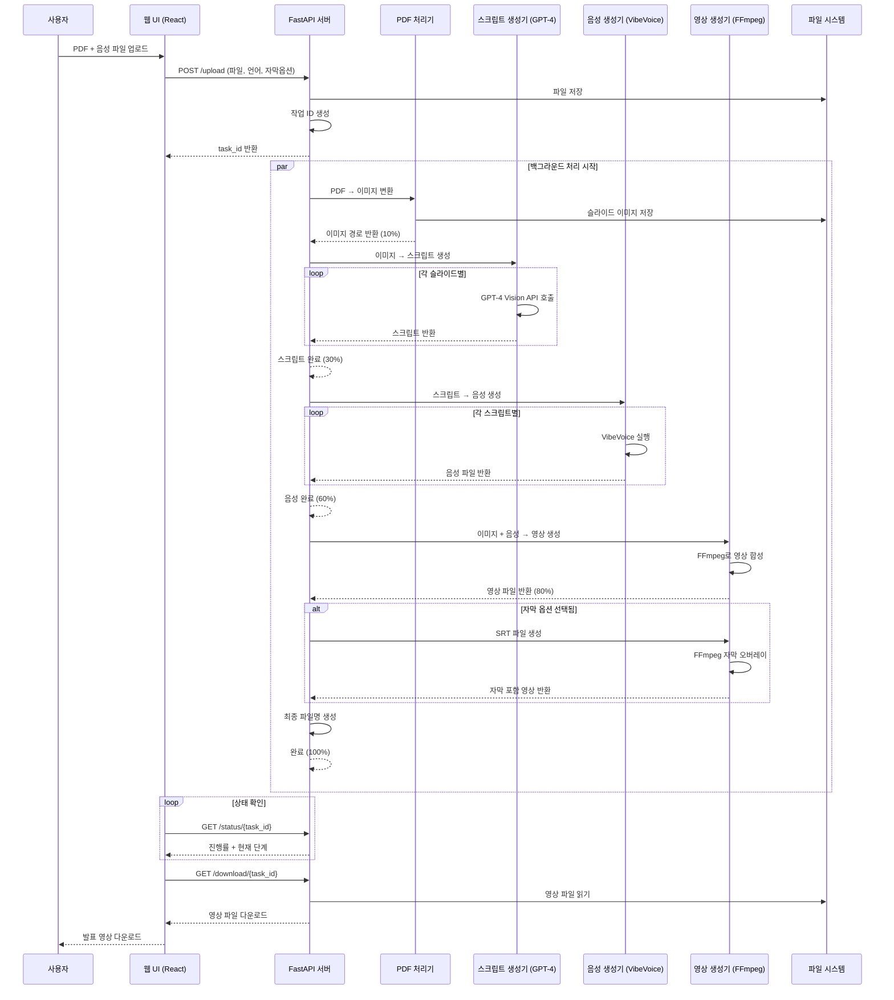
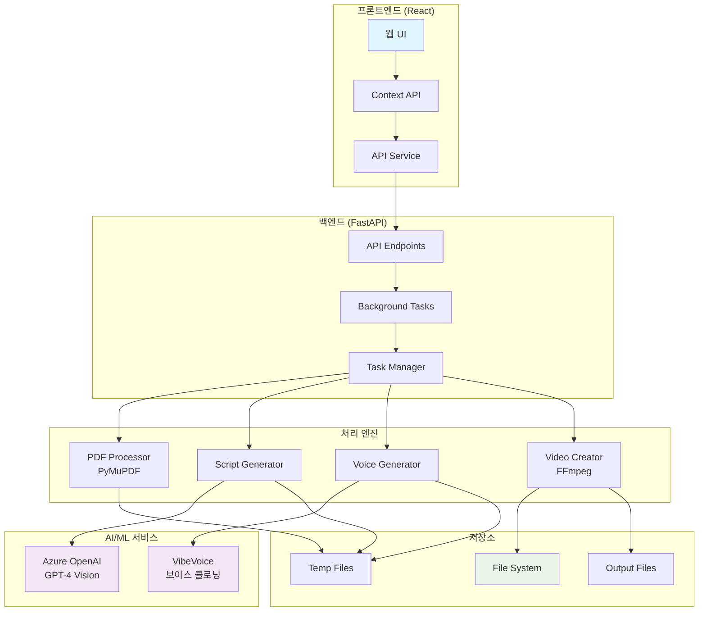

# PDF 발표 영상 자동 생성기

PDF 문서를 자동으로 발표 영상으로 변환하는 웹 애플리케이션입니다. VibeVoice를 사용한 보이스 클로닝과 Azure OpenAI GPT-4 Vision을 활용하여 완전 자동화된 발표 영상을 생성합니다.

## 🚀 주요 기능

- **PDF → 영상 자동 변환**: PDF 문서를 슬라이드별로 분석하여 발표 영상 생성
- **AI 스크립트 생성**: GPT-4 Vision을 사용한 슬라이드 내용 기반 발표 스크립트 자동 생성
- **다국어 지원**: 한국어/영어 발표 영상 생성
- **보이스 클로닝**: VibeVoice를 활용한 개인화된 음성 생성
- **자막 옵션**: 발표 스크립트를 영상에 자막으로 표시
- **웹 UI**: React 기반 사용자 친화적 인터페이스
- **실시간 진행률**: 작업 진행 상황 실시간 모니터링
- **스마트 파일명**: PDF 파일명 기반 자동 파일명 생성

## 🎬 웹 데모

React 기반 웹 인터페이스를 제공합니다:

### 웹 UI 기능
- **파일 업로드**: PDF와 음성 샘플 파일 드래그 앤 드롭
- **언어 선택**: 한국어/영어 발표 언어 선택
- **자막 옵션**: 자막 포함 여부 선택
- **실시간 진행률**: 단계별 진행 상황 시각화
- **원클릭 다운로드**: 완성된 영상 즉시 다운로드

### 웹 데모 실행
```bash
cd web-demo
npm install
npm start
```

웹 데모가 `http://localhost:3000`에서 실행됩니다.

## 🛠️ 개발 스택

### 백엔드
- **Framework**: FastAPI (Python 웹 프레임워크)
- **AI/ML**: 
  - Azure OpenAI GPT-4 Vision (스크립트 생성)
  - VibeVoice (보이스 클로닝)
- **비디오 처리**: FFmpeg
- **PDF 처리**: PyMuPDF (fitz)
- **비동기 처리**: asyncio
- **API 문서**: Swagger UI (자동 생성)

### 프론트엔드
- **Framework**: React 18
- **스타일링**: Styled Components
- **상태 관리**: React Context API
- **HTTP 클라이언트**: Axios
- **아이콘**: React Icons
- **빌드 도구**: Create React App

### 인프라 & 도구
- **언어**: Python 3.8+, JavaScript (ES6+)
- **패키지 관리**: pip, npm
- **개발 환경**: WSL2, SSH
- **버전 관리**: Git
- **API 테스트**: curl, Swagger UI

## 📋 시스템 요구사항

### 필수 소프트웨어
- Python 3.8+
- Node.js 16+ (웹 데모용)
- FFmpeg (오디오/비디오 처리)
- CUDA (GPU 가속, 선택사항)

### 하드웨어 권장사항
- **CPU**: 8코어 이상
- **RAM**: 16GB 이상
- **GPU**: NVIDIA GPU 8GB VRAM 이상 (VibeVoice 사용 시)
- **저장공간**: 10GB 이상 여유 공간

## 🛠️ 설치 및 설정

### 1. 저장소 클론
```bash
git clone <repository-url>
cd pdf-presentation-generator
```

### 2. 백엔드 의존성 설치
```bash
pip install -r requirements.txt
```

### 3. 웹 데모 의존성 설치
```bash
cd web-demo
npm install
```

### 4. VibeVoice 설정
```bash
# VibeVoice 디렉토리가 /home/devsy/workspace/VibeVoice에 위치해야 함
# VibeVoice 설치 및 모델 다운로드 필요
```

### 5. 환경변수 설정
프로젝트 루트에 `.env` 파일을 생성하고 다음 내용을 추가하세요:

```bash
# Azure OpenAI 설정
AZURE_OPENAI_API_KEY=your_azure_openai_api_key_here
AZURE_OPENAI_ENDPOINT=https://your-resource.openai.azure.com/

# VibeVoice 설정 (선택사항)
VIBEVOICE_MODEL_PATH=/path/to/vibevoice/models

# 서버 설정
HOST=0.0.0.0
PORT=9200

# 개발 환경 설정
DEBUG=False
LOG_LEVEL=INFO
```

**중요**: `.env` 파일은 Git에 커밋되지 않습니다. 실제 API 키를 입력하세요.

### 6. 서버 실행
```bash
# 백엔드 서버 실행
python main.py

# 웹 데모 실행 (새 터미널에서)
cd web-demo
npm start
```

- 백엔드 서버: `http://localhost:9200`
- 웹 데모: `http://localhost:3000`

## 📚 API 사용법

### 1. 파일 업로드 및 발표영상 생성
```bash
curl -X POST "http://localhost:9200/upload" \
  -F "pdf_file=@presentation.pdf" \
  -F "speaker_audio=@my_voice.wav" \
  -F "language=korean" \
  -F "include_subtitles=true"
```

**파라미터:**
- `pdf_file`: PDF 파일 (필수)
- `speaker_audio`: 음성 샘플 파일 (필수)
- `language`: 발표 언어 (`korean` 또는 `english`, 기본값: `korean`)
- `include_subtitles`: 자막 포함 여부 (`true` 또는 `false`, 기본값: `false`)

**응답 예시:**
```json
{
  "task_id": "123e4567-e89b-12d3-a456-426614174000",
  "status": "processing",
  "message": "파일이 업로드되었고 발표영상 생성이 시작되었습니다.",
  "language": "korean",
  "include_subtitles": true,
  "check_status_url": "/status/123e4567-e89b-12d3-a456-426614174000",
  "download_url": "/download/123e4567-e89b-12d3-a456-426614174000"
}
```

### 2. 작업 상태 확인
```bash
curl http://localhost:9200/status/123e4567-e89b-12d3-a456-426614174000
```

**응답 예시:**
```json
{
  "task_id": "123e4567-e89b-12d3-a456-426614174000",
  "status": "processing",
  "progress": 65,
  "current_step": "한국어 음성 생성 중... (2/3)",
  "created_at": "2024-01-01T12:00:00",
  "completed_at": null,
  "error_message": null,
  "result_file": null,
  "download_filename": "presentation_korean.mp4"
}
```

### 3. 결과 다운로드
```bash
curl -O http://localhost:9200/download/123e4567-e89b-12d3-a456-426614174000
```

## 🔄 작업 흐름

1. **파일 업로드** → PDF와 음성 샘플 업로드
2. **백그라운드 처리**:
   - PDF → 슬라이드 이미지 변환 (0-10%)
   - GPT-4 Vision → 발표 스크립트 생성 (15-30%)
   - VibeVoice → 음성 생성 (35-60%)
   - FFmpeg → 영상 생성 및 합치기 (65-80%)
   - 자막 오버레이 (선택사항)
3. **상태 모니터링** → 실시간 진행 상황 확인
4. **결과 다운로드** → 완성된 발표 영상 다운로드

## 📊 시스템 아키텍처 다이어그램



## 🏗️ 컴포넌트 아키텍처



## 📊 API 엔드포인트

| 메서드 | 엔드포인트 | 설명 |
|--------|------------|------|
| GET | `/` | API 정보 |
| GET | `/health` | 시스템 상태 확인 |
| POST | `/upload` | 파일 업로드 + 발표영상 자동 생성 |
| GET | `/status/{task_id}` | 작업 상태 확인 |
| GET | `/download/{task_id}` | 결과 파일 다운로드 |
| GET | `/tasks` | 작업 목록 조회 |
| DELETE | `/tasks/{task_id}` | 작업 삭제 |

## 🌍 다국어 지원

### 한국어 발표
- 한국어 최적화된 스크립트 생성
- 한국어 발표 표현 및 연결어 사용
- 파일명: `{PDF파일명}_korean.mp4`

### 영어 발표
- 영어 발표 스크립트 생성
- 영어 발표 표현 및 연결어 사용
- 파일명: `{PDF파일명}_english.mp4`

## 📝 자막 기능

### 자막 스타일
- **폰트 크기**: 18px
- **텍스트 색상**: 흰색
- **테두리**: 검은색 2px
- **위치**: 화면 하단

### 자막 타이밍
- 각 슬라이드의 실제 오디오 길이 기반
- SRT 형식으로 정확한 동기화
- 자동 시간 계산 및 누적

## 📝 스크립트 생성 특징

### 자동 스크립트 구조
- **첫 번째 슬라이드**: 인사말과 함께 발표 시작, 청중의 관심을 끄는 첫인상
- **중간 슬라이드**: 이전 내용과 자연스럽게 연결, 연결어 활용
- **마지막 슬라이드**: 마무리 표현과 함께 "감사합니다" 인사말 포함

### 언어별 최적화
- **한국어**: "다음으로", "또한", "마지막으로" 등 한국어 연결어
- **영어**: "Next", "Additionally", "Finally" 등 영어 연결어

### 스크립트 품질
- 각 슬라이드마다 정확히 2문장으로 구성
- 슬라이드 이미지 내용을 정확히 분석하여 작성
- 발표 속도에 맞는 쉼표와 휴지 자동 추가

## 🎛️ 품질 설정

### 고정 설정
- **품질 모드**: `stable_korean` (한국어 안정성 최적화)
- **슬라이드 지속시간**: 5초 (최소값)
- **모델**: VibeVoice-1.5B
- **CFG 스케일**: 1.6

## 🔒 보안 및 환경변수

### API 키 보안
- **절대 하드코딩 금지**: API 키를 코드에 직접 작성하지 마세요
- **환경변수 사용**: `.env` 파일을 통해 API 키 관리
- **Git 무시**: `.env` 파일은 `.gitignore`에 포함되어 Git에 커밋되지 않습니다

### 환경변수 설정
```bash
# .env 파일 생성
touch .env

# API 키 설정
echo "AZURE_OPENAI_API_KEY=your_actual_api_key_here" >> .env
echo "AZURE_OPENAI_ENDPOINT=https://your-resource.openai.azure.com/" >> .env
```

### 보안 체크리스트
- [ ] `.env` 파일이 `.gitignore`에 포함되어 있는지 확인
- [ ] API 키가 코드에 하드코딩되지 않았는지 확인
- [ ] 프로덕션 환경에서는 HTTPS 사용
- [ ] API 키를 정기적으로 로테이션

## 🚨 주의사항

1. **VibeVoice 설정**: VibeVoice가 올바르게 설치되고 모델이 다운로드되어 있어야 합니다.
2. **메모리 관리**: GPU 메모리 부족 시 CPU 모드 사용을 권장합니다.
3. **파일 형식**: PDF 파일과 WAV/MP3 음성 파일만 지원됩니다.
4. **처리 시간**: 슬라이드 수에 따라 처리 시간이 달라집니다 (슬라이드당 약 1-2분).
5. **네트워크**: WSL/SSH 환경에서 포트 매핑이 동적으로 변경될 수 있습니다.
6. **API 키 보안**: 환경변수를 통해 API 키를 안전하게 관리하세요.

## 🐛 문제 해결

### 일반적인 오류

1. **VibeVoice 실행 실패**
   - VibeVoice 디렉토리 경로 확인
   - 모델 파일 존재 여부 확인
   - GPU 메모리 부족 시 CPU 모드 사용

2. **메모리 부족 오류**
   - 시스템 메모리 확인
   - 다른 프로세스 종료
   - VibeVoice 모델 크기 확인

3. **파일 업로드 실패**
   - 파일 형식 확인 (PDF, WAV/MP3)
   - 파일 크기 제한 확인 (100MB)
   - 네트워크 연결 상태 확인

4. **네트워크 연결 문제**
   - WSL 포트 매핑 확인
   - API URL 설정 확인
   - 방화벽 설정 확인

## 📝 로그 및 모니터링

서버 실행 시 콘솔에서 실시간 로그를 확인할 수 있습니다:
- 파일 업로드 상태
- 각 단계별 진행 상황 (PDF 처리, 스크립트 생성, 음성 생성, 영상 생성)
- 오류 메시지 및 해결 방법
- 시스템 리소스 사용량

## 🎯 사용 예시

### 웹 UI 사용
1. 웹 브라우저에서 `http://localhost:3000` 접속
2. PDF 파일과 음성 샘플 파일 업로드
3. 언어 선택 (한국어/영어)
4. 자막 포함 여부 선택
5. "발표 영상 생성" 버튼 클릭
6. 진행률 확인 후 완성된 영상 다운로드

### API 사용
```bash
# 발표 영상 생성
curl -X POST "http://localhost:9200/upload" \
  -F "pdf_file=@marketing_strategy.pdf" \
  -F "speaker_audio=@my_voice.wav" \
  -F "language=english" \
  -F "include_subtitles=true"

# 상태 확인
curl http://localhost:9200/status/{task_id}

# 다운로드
curl -O http://localhost:9200/download/{task_id}
```

## 🤝 기여하기

1. Fork the repository
2. Create a feature branch
3. Commit your changes
4. Push to the branch
5. Create a Pull Request

## 📄 라이선스

이 프로젝트는 MIT 라이선스 하에 배포됩니다.

## 📞 지원

문제가 발생하거나 질문이 있으시면 이슈를 생성해 주세요.