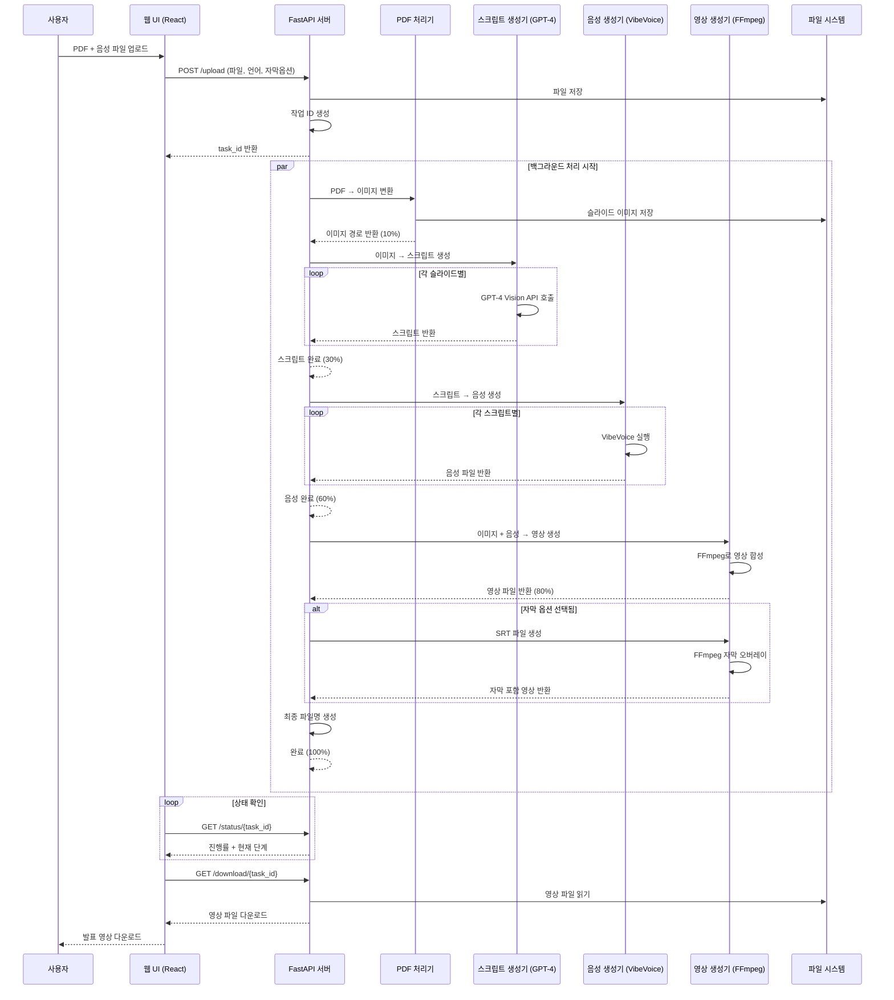
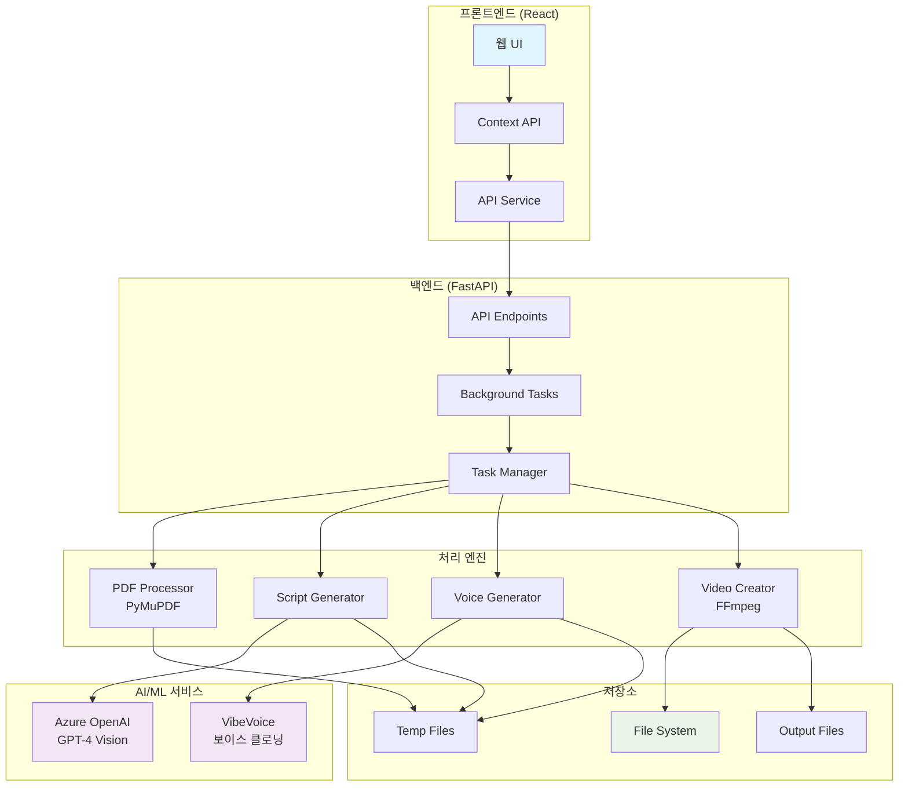
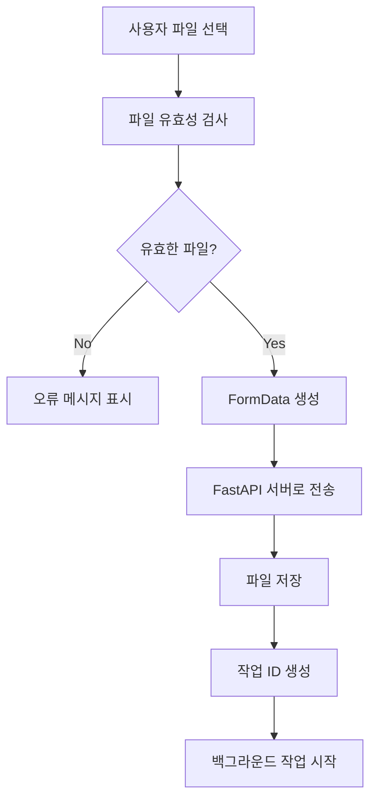
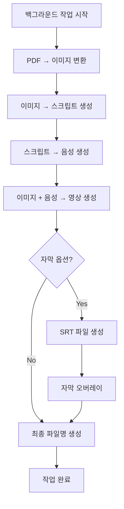
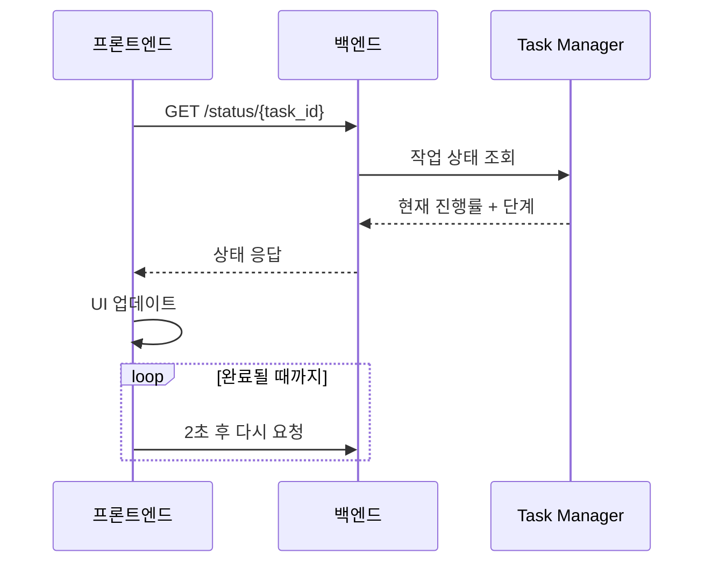
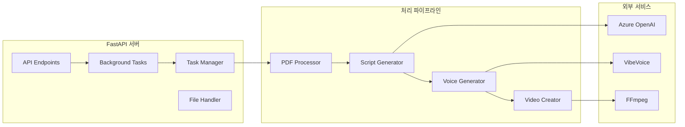
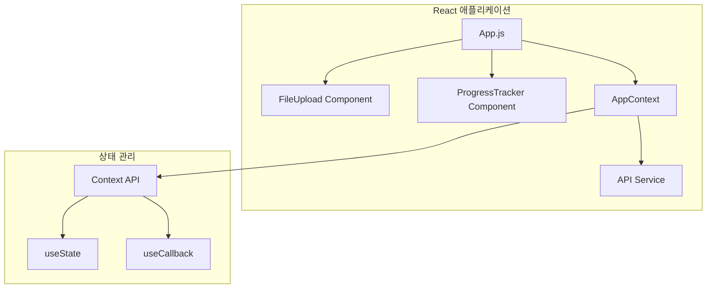
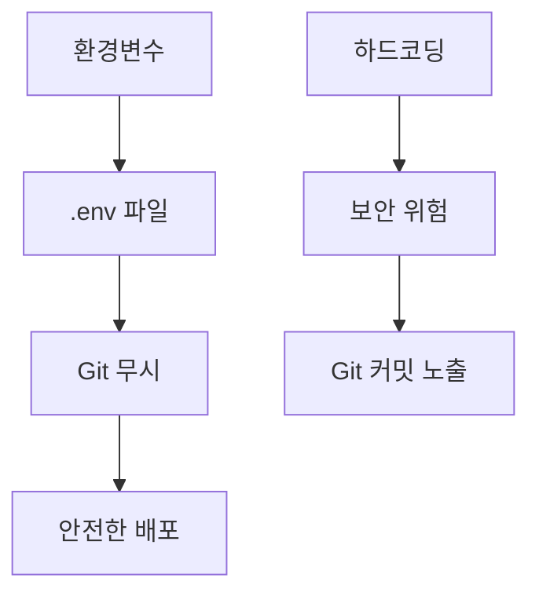

# 시스템 아키텍처

PDF 발표 영상 자동 생성기의 시스템 아키텍처와 컴포넌트 구조를 설명합니다.

## 📊 시스템 아키텍처 다이어그램

### 전체 워크플로우



## 🏗️ 컴포넌트 아키텍처

### 시스템 구성 요소



## 🔄 데이터 플로우

### 1. 파일 업로드 플로우



### 2. 백그라운드 처리 플로우



### 3. 상태 모니터링 플로우



## 📁 디렉토리 구조

```
pdf-presentation-generator/
├── core/                    # 핵심 처리 모듈
│   ├── pdf_processor.py     # PDF → 이미지 변환
│   ├── script_generator.py  # 이미지 → 스크립트 생성
│   ├── voice_generator.py   # 스크립트 → 음성 생성
│   └── video_creator.py     # 영상 생성 및 합성
├── models/                  # 데이터 모델
│   └── schemas.py          # Pydantic 모델 정의
├── web-demo/               # React 웹 데모
│   ├── src/
│   │   ├── components/     # React 컴포넌트
│   │   ├── context/        # 상태 관리
│   │   └── services/       # API 서비스
│   └── package.json
├── docs/                   # 문서
│   └── architecture.md     # 이 파일
├── main.py                 # FastAPI 메인 서버
├── requirements.txt        # Python 의존성
└── README.md              # 프로젝트 개요
```

## 🔧 기술 스택 상세

### 백엔드 아키텍처



### 프론트엔드 아키텍처



## 🚀 성능 최적화

### 비동기 처리
- FastAPI의 `BackgroundTasks`를 사용한 비동기 처리
- `asyncio.sleep(0)`을 통한 이벤트 루프 양보
- 실시간 진행률 업데이트

### 메모리 관리
- 임시 파일 자동 정리
- 스트리밍 파일 처리
- GPU 메모리 효율적 사용

### 확장성
- 모듈화된 컴포넌트 구조
- 환경변수를 통한 설정 관리
- 마이크로서비스 아키텍처 준비

## 🔒 보안 아키텍처

### API 키 보안


### 파일 보안
- 업로드 파일 유효성 검사
- 임시 파일 자동 삭제
- 파일 크기 제한

## 📊 모니터링 및 로깅

### 로그 구조
- 단계별 진행률 로그
- 오류 추적 및 디버깅
- 성능 메트릭 수집

### 상태 추적
- 실시간 작업 상태
- 진행률 퍼센티지
- 현재 처리 단계
