# 시스템 아키텍처

PDF 발표 영상 자동 생성기의 시스템 아키텍처와 컴포넌트 구조를 설명합니다.

## 📊 시스템 아키텍처 다이어그램

### 전체 워크플로우

```mermaid
sequenceDiagram
    participant U as 사용자
    participant W as 웹 UI (React)
    participant A as FastAPI 서버
    participant P as PDF 처리기
    participant S as 스크립트 생성기 (GPT-4)
    participant V as 음성 생성기 (VibeVoice)
    participant VC as 영상 생성기 (FFmpeg)
    participant F as 파일 시스템

    U->>W: PDF + 음성 파일 업로드
    W->>A: POST /upload (파일, 언어, 자막옵션)
    A->>F: 파일 저장
    A->>A: 작업 ID 생성
    A-->>W: task_id 반환
    
    par 백그라운드 처리 시작
        A->>P: PDF → 이미지 변환
        P->>F: 슬라이드 이미지 저장
        P-->>A: 이미지 경로 반환 (10%)
        
        A->>S: 이미지 → 스크립트 생성
        loop 각 슬라이드별
            S->>S: GPT-4 Vision API 호출
            S-->>A: 스크립트 반환
        end
        A-->>A: 스크립트 완료 (30%)
        
        A->>V: 스크립트 → 음성 생성
        loop 각 스크립트별
            V->>V: VibeVoice 실행
            V-->>A: 음성 파일 반환
        end
        A-->>A: 음성 완료 (60%)
        
        A->>VC: 이미지 + 음성 → 영상 생성
        VC->>VC: FFmpeg로 영상 합성
        VC-->>A: 영상 파일 반환 (80%)
        
        alt 자막 옵션 선택됨
            A->>VC: SRT 파일 생성
            VC->>VC: FFmpeg 자막 오버레이
            VC-->>A: 자막 포함 영상 반환
        end
        
        A->>A: 최종 파일명 생성
        A-->>A: 완료 (100%)
    end
    
    loop 상태 확인
        W->>A: GET /status/{task_id}
        A-->>W: 진행률 + 현재 단계
    end
    
    W->>A: GET /download/{task_id}
    A->>F: 영상 파일 읽기
    A-->>W: 영상 파일 다운로드
    W-->>U: 발표 영상 다운로드
```

## 🏗️ 컴포넌트 아키텍처

### 시스템 구성 요소

## 🔄 데이터 플로우

### 1. 파일 업로드 플로우

```mermaid
flowchart TD
    A[사용자 파일 선택] --> B[파일 유효성 검사]
    B --> C{유효한 파일?}
    C -->|No| D[오류 메시지 표시]
    C -->|Yes| E[FormData 생성]
    E --> F[FastAPI 서버로 전송]
    F --> G[파일 저장]
    G --> H[작업 ID 생성]
    H --> I[백그라운드 작업 시작]
```

### 2. 백그라운드 처리 플로우

```mermaid
flowchart TD
    A[백그라운드 작업 시작] --> B[PDF → 이미지 변환]
    B --> C[이미지 → 스크립트 생성]
    C --> D[스크립트 → 음성 생성]
    D --> E[이미지 + 음성 → 영상 생성]
    E --> F{자막 옵션?}
    F -->|Yes| G[SRT 파일 생성]
    F -->|No| H[최종 파일명 생성]
    G --> I[자막 오버레이]
    I --> H
    H --> J[작업 완료]
```

